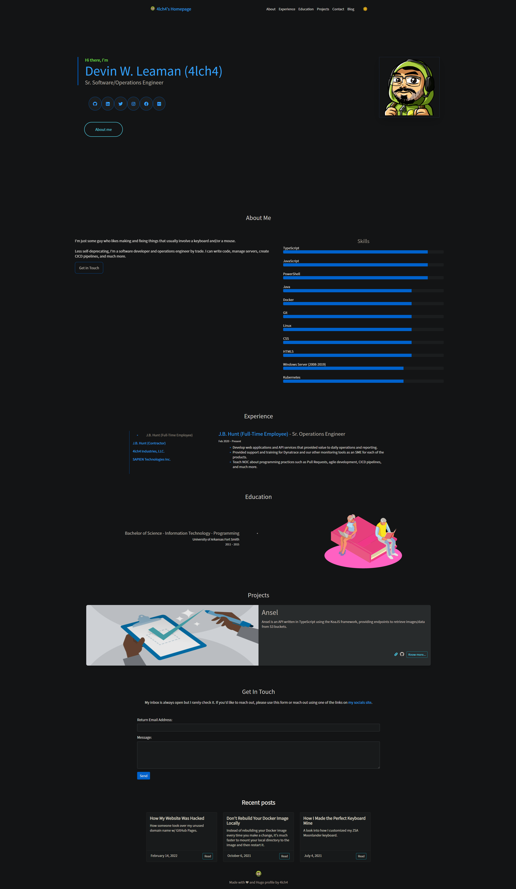

   

# 4lch4.com

This repo is home to my [homepage/personal website][0]. It's a fairly simple website that I created using [Hugo][3] and the [Hugo-Profile][1] theme ([which I've forked][2]).

## Screenshot

[0]: https://4lch4.com
[1]: https://themes.gohugo.io/themes/hugo-profile/
[2]: https://github.com/4lch4/hugo-profile
[3]: https://gohugo.io
